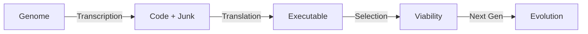

# 🍎🐍 The Eden's Sins — DNA Polymorphic Engine

> **Bio-mimetic Polymorphism on Rust**

Standard polymorphic engines use random padding and simple instruction substitution.
**The Eden's Sins** uses a full **biological model** to simulate evolution:

- **Genome**: Code represented as DNA codons (instruction variants).
- **Polymorphism**: Genetic Code Table degeneracy (multiple codons = same operation).
- **Mutation**: Point mutations (silent), frameshifts, and crossover.
- **Repair**: Base Excision Repair (BER) to self-heal bit rot.
- **Morphogenesis**: Turing patterns (Reaction-Diffusion) determine code layout.
- **Nucleus**: Evolutionary cell cycle to grow, mutate, and select viable variants.

## Architecture



### Components

| Crate | Logic | Biological Analogy |
|---|---|---|
| `eden-arch` | Instruction Encoding | Nucleotides |
| `eden-genome` | Codon/Gene Structure | DNA |
| `eden-mutator` | Point Mutations | Polymerase Error |
| `eden-repair` | Integrity Checks | DNA Repair (BER/MMR) |
| `eden-morphogen` | Gray-Scott Model | Morphogenesis |
| `eden-transcriber` | Layout & Code Gen | Ribosome |
| `eden-nucleus` | Cell Cycle Loop | Cell Life |

## Usage (Lab)

```bash
# Run tests (Unit Verification)
cargo test --workspace

# (Future) Generate a variant
cargo run --bin eden generate -- --generations 50 --entropy 6.0
```

## Purple Team Validations

### Detections
See `detections/` for YARA rules targeting the engine's artifacts:
- Entropy anomalies (too low/high).
- NOP sled signatures (`0F 1F ...`).
- Repetitive morphogen patterns.

### Evasion Philosophy
> "Nature doesn't hide. It adapts."

The goal is not to be invisible (0 entropy), but to look **natural** (5.0-6.5 entropy) and structurally diverse.

---
⚠️ **Authorized Testing Only**. For educational and defensive research.
